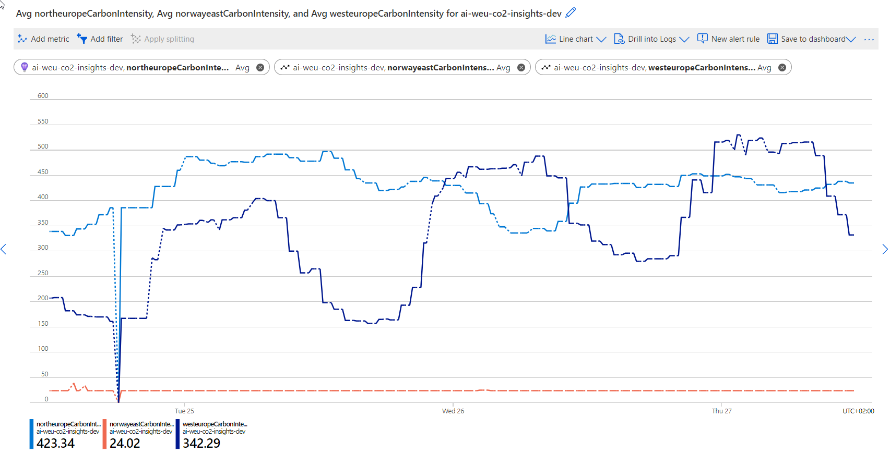

Carbon AppInsights
==================

Log ElectricityMaps Emissions data for Azure regions to AppInsights
-------------------------------------------------------------------

This is a simple Azure Function App that logs the emissions data for Azure
regions to AppInsights. From Application Insights and the configured Log
Analytics workspace, you can create dashboards and alert rules to use in scaling
operations and feature flags.

The function is triggered by a timer every 20 minutes. The function will log
a metric `{region}CarbonIntensity` for each region in the configured list of
regions. The metric value is the carbon intensity in grams of CO2 per kWh.



### Usage

This function is designed to be deployed to Azure as a Function App with the
included _GitHub Workflow_ using bicep. To deploy the function, you will need
fork this repository and create a new GitHub repository secret named
`AZURE_CREDENTIALS` with the value of the output from the following command:

```bash
az ad sp create-for-rbac --name "CarbonAppInsights" --sdk-auth --role contributor --scopes /subscriptions/<SUBSCRIPTION_ID>
```

You will also need a secret named `AZURE_SUBSCRIPTION_ID` with the value of your
Azure subscription ID.

You will need to register for an API token at ElectricityMaps and add it as a
secret named `EMTOKEN` to your repository.

Then run the deployment workflow by running the _Deploy Bicep code_ workflow
configured in your forked repository from the file
`.github/workflows/deploy-bicep.yml`.

### Configuration

To configure your own deployment, you will need to edit the
`src/bicep/main.parameters.json` with your own desired configuration.

#### Parameters

| Name | Type | Default | Description |
| --- | --- | --- | --- |
|`projectName`|`string`|`carbon-appinsights`|The name of the project. Used in naming resources|
|`environment`|`string`|`dev`|The name of the environment. Used in naming resources|
|`location`|`string`|`westeurope`|The Azure region to deploy the resources to|
|`emToken`|`securestring`|`null`|The ElectricityMaps API token. Should be specified in cmdline with env var|
|`emissionRegions`|`string`|"westeurope","norwayeast","northeurope"|The list of regions to log emissions data for|

### Deployed resources

The following resources are deployed by the bicep template:

| Type | Description |
| --- | --- |
|KeyVault|A KeyVault to store the ElectricityMaps API key|
|FunctionApp|An Azure Function App to run the PowerShell function|
|ApplicationInsights|An Application Insights instance to log the emissions data|
|LogAnalyticsWorkspace|A Log Analytics workspace to store the emissions data|
|StorageAccount|A Storage Account to store the Function App code|
|AppServicePlan|An App Service Plan to host the Function App|
